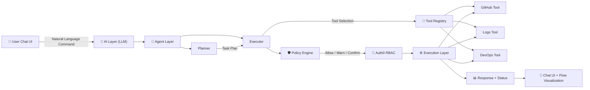

# 🛡️ OpsGuardian: AI-Powered DevOps Copilot

OpsGuardian is an **AI-powered DevOps Copilot** that understands natural language commands, makes intelligent decisions, executes safe actions, and explains its reasoning—all while strictly enforcing **security policies and permissions**.

Think of it as **ChatGPT for DevOps**, but with enterprise-grade guardrails.

---

## 🧠 Project Goal

OpsGuardian bridges the gap between AI autonomy and infrastructure security by enabling:

- **Natural Language Execution:** Run complex DevOps tasks via simple chat.
- **Intent Understanding:** LLM-driven reasoning to determine the best course of action.
- **Permission Enforcement:** Native integration with **Auth0 (JWT + RBAC)**.
- **Safe Guardrails:** Policy checks and mandatory confirmation steps for "destructive" actions.
- **Observability:** Real-time **technical flow visualization** in the UI.

---

## 📺 Demo


**Example Flow:**
1. **Input:** User types `"Restart payment service"`.
2. **Reasoning:** AI displays its thought process (e.g., "Checking service status...").
3. **Safety Check:** A confirmation button appears because the action is flagged as "Risky."
4. **Validation:** System validates the user's **Auth0 JWT** for the required permissions.
5. **Execution:** Once confirmed, the service restarts and the UI flow updates in real-time.

---

## 🏗️ Architecture

### High-Level Component Map
```text
           ┌─────────────┐
           │  Frontend   │
           │ (JS Chat UI)│
           └─────┬───────┘
                 │
                 ▼
          ┌─────────────┐
          │ Spring Boot │
          │   API       │
          └─────┬───────┘
                 │
      ┌──────────┴──────────┐
      │  Auth0 JWT Validation│
      │  (issuer + audience) │
      └──────────┬──────────┘
                 │
          ┌─────────────┐
          │    LLM      │
          │ Decision Engine│
          └─────┬───────┘
                 │
     ┌───────────┴───────────┐
     │   Agent Service        │
     │  - Policy Check        │
     │  - RBAC Enforcement    │
     │  - Confirmation Layer  │
     └───────────┬───────────┘
                 │
      ┌──────────┴───────────┐
      │ External APIs        │
      │ - GitHub             │
      │ - AWS                │
      │ - Logs / Metrics     │
      └──────────┬───────────┘
                 │
                 ▼
              ┌───────┐
              │  UI   │
              │ Response │
              └───────┘
```
Logic Flow (Mermaid)


## ✅ Features Implemented

### 🤖 LLM Decision Engine
- Converts natural language into structured actions

**Example:**
```json
{
  "action": "RESTART_SERVICE",
  "target": "payment-service",
  "reason": "Service instability detected"
}
```

---

### 🔐 Secure Execution
- Auth0 JWT validation
- Role-Based Access Control (RBAC)
- Permission-based execution

---

### 🛡️ Safety Guardrails
- Risk detection before execution
- Mandatory confirmation for critical actions

**Flow:**  
LLM → Risk Check → Confirm → Execute

---

### 💬 Chat UI
- Natural language input
- AI reasoning displayed step-by-step
- Confirmation buttons
- Flow visualization

---

### 🔗 Integrations
- GitHub (issues, repositories)
- DevOps simulation APIs
- Logs & metrics

---

### 🧠 Transparent AI Reasoning
```
🧠 Understanding request...
📊 Analyzing intent...
⚙️ Deciding action...
🔐 Validating JWT...
🛡️ Checking permissions...
⚠️ Confirmation required
🚀 Executing...
✅ Done
```

---

## ⚡ Demo Script

Try these commands:
- Restart payment service
- Show logs for orders
- Scale checkout service to 3
- Create GitHub issue

---

## 🛠️ Setup

### Backend
```bash
git clone <repo-url>
cd copilot_backend
./mvnw spring-boot:run
```

OpsGuardian requires minimal configuration for **Auth0 authentication** and **LLM integration**.

---

### 🔐 Auth0 Configuration

```yaml
spring:
  security:
    oauth2:
      resourceserver:
        jwt:
          issuer-uri: https://dev-frvjdwj3fq0gwfb7.us.auth0.com/
```

- **issuer-uri**: Your Auth0 domain URL
- Used for validating incoming JWT tokens
- Ensures only authenticated users can access the API

---

### 🔑 Auth0 Machine-to-Machine (M2M)

```yaml
auth0:
  domain: <DOMAIN>
  m2m:
    client-id: <CLIENT_ID>
    client-secret: <CLIENT_SECRET>
```

- **domain**: Your Auth0 tenant domain
- **client-id / client-secret**: Credentials for backend-to-backend communication
- Used by the agent to securely call external APIs on behalf of the user

> ⚠️ Do NOT commit real credentials to GitHub. Use environment variables instead.

---

### 🤖 LLM Configuration

```yaml
llm:
  api:
    key: <API_KEY>
  model: gpt-4o-mini
```

- **api.key**: Your LLM provider API key
- **model**: LLM used for intent parsing and decision-making

---

### 🌐 Server Configuration

```yaml
server:
  port: 8080
```

- Defines the port where the backend runs
- Default: `http://localhost:8080`

---

### 📝 Logging (Debug Mode)

```yaml
logging:
  level:
    org.springframework.security: DEBUG
```

- Enables detailed logs for authentication and authorization
- Useful for debugging JWT validation and RBAC issues

---

### Frontend
- Open: `src/main/resources/static/index.html`
- Ensure JWT is set in `app.js`

---

## ⚙️ Commands

| Input                          | Action                  |
|--------------------------------|-------------------------|
| Restart payment service        | RESTART_SERVICE         |
| Scale checkout service         | SCALE_SERVICE           |
| Show logs                      | FETCH_LOGS              |
| Create GitHub issue            | CREATE_GITHUB_ISSUE     |

---

## 🛡️ Policies
- ❌ No production restarts
- ⚠️ Scaling requires confirmation
- 🔐 RBAC enforced

---

## 📝 Roadmap
- Streaming AI responses
- Session memory
- AWS integrations
- Better UI (timestamps, history)

---

## 👀 Hackathon Highlights
- 🔥 AI agent with real guardrails
- 🔐 Security-first design (Auth0 + RBAC)
- 🧠 Transparent AI reasoning
- ⚙️ Extensible architecture

---

## 🎯 Vision
A production-ready AI DevOps agent that:
- Understands natural language
- Makes safe decisions
- Executes securely
- Explains everything

---

## 📂 Project Structure
```
copilot_backend/
├─ service/AgentService.java
├─ llm/LlmService.java
├─ model/AgentDecision.java
├─ model/AgentResponse.java
│
└─ static/
   ├─ index.html
   ├─ app.js
```

---

## 📦 License
MIT License